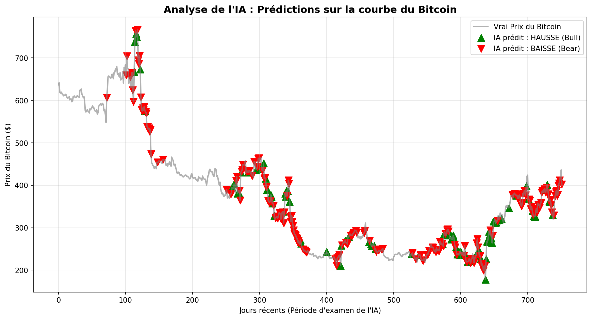

# ₿ Bitcoin Market Regime Detection (KNN)

A machine learning pipeline using a **K-Nearest Neighbors (KNN)** classifier to predict short-term financial market regimes for Bitcoin: **Bull** (upward trend), **Bear** (downward trend), or **Range** (stagnant / choppy market).

Academic project — Faculty of Sciences and Technology, Tangier (Module: Artificial Intelligence, Major SSD, 2025/2026).

## 📊 Overview

Stock/crypto price prediction is a hard problem: absolute price is dominated by scale (Bitcoin went from ~$400 in 2014 to $90,000+), so raw prices are useless as KNN features. This project instead engineers a **"Market DNA"** — stationary, normalized indicators of momentum, volatility, and trend — and uses historical similarity (KNN) to classify the current market regime.

## 🧠 Methodology

1. **Preprocessing** — clean raw CSV (comma-formatted thousands, whitespace in headers), parse dates, verify no missing values (Forward Fill as safety net).
2. **Feature Engineering ("Market DNA")**:
   - **Momentum**: Daily Return, RSI (14-day)
   - **Volatility**: ATR (14-day), normalized to NATR (%)
   - **Trend**: 50-day SMA, distance to SMA (%)
3. **Labeling** — 5-day forward-looking return, thresholded at ±3%:
   - Bull (+1): future return > +3%
   - Bear (-1): future return < -3%
   - Range (0): everything else
4. **Split & Scale** — chronological 80/20 split (`shuffle=False`, no data leakage), `StandardScaler` fit only on train.
5. **Model** — `KNeighborsClassifier(n_neighbors=15, metric='euclidean', weights='distance')`.
6. **Evaluation** — precision / recall / F1-score per class (robust to class imbalance).
7. **Visualization** — model predictions plotted directly on the Bitcoin price chart.

## 📈 Results

| Regime | Precision | Recall | F1-score |
|---|---|---|---|
| Bear (-1) | 0.39 | 0.39 | 0.39 |
| Range (0) | 0.62 | 0.76 | 0.68 |
| Bull (1) | 0.33 | 0.18 | 0.24 |

The model performs best identifying **Range** (consolidation) days, aided by class majority. It struggles with directional **Bull**/**Bear** calls — in particular it misses 82% of true Bull days (low recall) — suggesting market regimes are non-linear and may need ensemble methods (Random Forest) or deep learning to capture more effectively.



The chart shows a visible **lag**: the model tends to confirm a regime change only after the trend is already underway, a common limitation of moving-average / RSI-based features. Still, it works as a supplementary technical indicator rather than a standalone trading bot.

## 📁 Project Structure

```text
bitcoin-regime-detection-knn/
│
├── README.md
├── requirements.txt
├── .gitignore
├── main.py                  # Runs the full pipeline end-to-end
│
├── data/
│   └── bitcoin_history.csv  # Raw dataset (~10 years of daily OHLCV data)
│
├── src/
│   ├── __init__.py
│   ├── preprocessing.py     # Step 1: load, clean, check missing values
│   ├── features.py          # Step 2: Market DNA feature engineering
│   ├── labeling.py          # Step 3: regime labeling (Bull/Bear/Range)
│   ├── model.py             # Step 4-5: split, scale, train, evaluate KNN
│   └── visualize.py         # Step 6: plot predictions on price chart
│
└── outputs/
    └── regime_predictions.png
```

## 🚀 Usage

```bash
git clone https://github.com/Salma-Rhomari/bitcoin-regime-detection-knn.git
cd bitcoin-regime-detection-knn
pip install -r requirements.txt
python main.py
```

This regenerates `data/bitcoin_clean.csv`, trains the KNN model, prints the classification report, and saves the prediction chart to `outputs/regime_predictions.png`.

## 🛠️ Technologies

- Python
- Pandas / pandas_ta (technical indicators)
- Scikit-learn (KNN, StandardScaler, train_test_split, classification_report)
- Matplotlib

## 👥 Authors

- Rhomari Salma
- Erradi Youssef
- Bouaksi Mohamed

**Supervised by:** Pr. Sanae Khali Issa
**Major:** SSD — Statistics and Data Science
